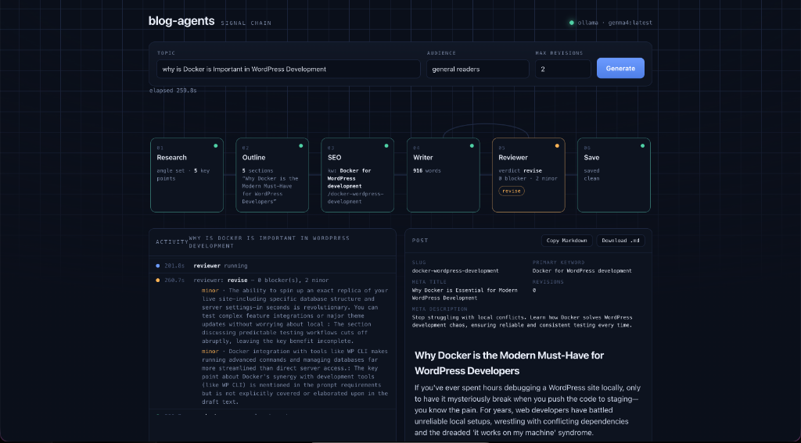

# blog-agents

A five-agent blog-writing pipeline with a verifier-gated revision loop. One
container, one process: FastAPI serves the UI and runs the LangGraph pipeline
in-process against a local LLM (Ollama or LM Studio).

```
research → outline → seo → writer → reviewer ─┬─ approve / minor-only ─→ save
                              ↑                └─ blocker & under limit ─→ writer
                              └──────────── revision (targeted) ─────────┘
```

## Why one container

The pipeline is sequential and every agent calls the same single local model, so
there's nothing to scale independently. A single process is the right size:
agents are function calls, progress streams over an in-memory queue, no Redis, no
inter-service HTTP. The module layout still keeps clean seams (`agents/`,
`pipeline.py`, `llm.py`, `schemas.py`), so if one agent ever needs its own model
or box, promoting it to a service is a contained change rather than a rewrite.
## Prerequisites

Before running the application, ensure you have the following installed:
- **Docker & Docker Compose** (recommended for containerized setup)
- **Python 3.9+** (required for local runs)
- An LLM backend: **Ollama** (running locally) or **LM Studio**

## Run

```bash
cp .env.example .env
docker compose up --build
docker compose exec ollama ollama pull llama3.1     # first run only
```

Open http://localhost:8000. (`make up`, `make pull-model`, `make logs`, `make down`.)

Using a model already on the host (LM Studio, or your own Ollama)? Drop the
`ollama` service and set `BLOG_BASE_URL=http://host.docker.internal:11434/v1`
(or `:1234/v1` + `BLOG_PROVIDER=lmstudio`) in `.env`.

### Without Docker

```bash
pip install -r requirements.txt
uvicorn app.server:app --port 8000     # web UI  (make dev)
python -m app.cli "your topic here"    # or the CLI
```

## The interface



The UI streams each stage live: the pipeline board lights each agent as it runs,
and the reviewer→writer **feedback cable** pulses whenever a revision routes —
the loop is the thing you watch. Finished posts render with their SEO metadata
and Copy / Download buttons, and are written to `./output`.

## The revision loop

The reviewer only reports — it returns a `verdict` plus issues tagged
`blocker`/`minor`. `pipeline.route_after_review` owns the branch: approve or
minor-only → save; blockers under the limit → back to the writer with the issues
attached (targeted edit, not a rewrite); at the limit → save with a warning
banner listing what's unresolved. Cap with `BLOG_MAX_REVISIONS` (default 2).

## Reliable JSON from local models

In `app/llm.py`: the Pydantic schema is passed as `response_format` for
grammar-constrained decoding, the schema is also stated in the prompt (Ollama
doesn't inject it), and output is validated with a one-shot repair retry, falling
back from `json_schema` to `json_object` mode for servers that reject it.

## Layout

```
app/
  server.py      FastAPI: serves UI, streams a run as NDJSON
  cli.py         same pipeline from the terminal
  pipeline.py    LangGraph graph + routing + revision loop
  agents/        research · outline · seo · writer · reviewer (run functions)
  llm.py         the only module that calls the model
  schemas.py     Pydantic contracts between agents
  config.py      model backend + revision limit
  prompts/       one prompt per agent
  web/index.html the UI
Dockerfile · docker-compose.yml (app + ollama) · Makefile
tests/           schema, loop, and server tests — all run offline
```

## Tests (offline — no Docker or model needed)

```bash
python -m tests.run_all        # or: pytest -q
```

- `test_schemas` — contracts parse + round-trip.
- `test_loop` — all four revision-loop paths with the model faked, events captured.
- `test_server` — a full run streamed through the HTTP endpoint, ending in a saved post.

## Configuration

The application can be configured using environment variables (stored in `.env`).

| Variable | Description | Default |
|----------|-------------|---------|
| `BLOG_PROVIDER` | Backend provider (`ollama` or `lmstudio`) | `ollama` |
| `BLOG_BASE_URL` | Endpoint url for the LLM API | `http://localhost:11434/v1` |
| `BLOG_API_KEY` | API key (if needed by your model backend) | `not-needed` |
| `BLOG_MODEL` | Default model for agents | `llama3.1` (Ollama) or `local-model` (LM Studio) |
| `BLOG_MODEL_STRONG` | High-reasoning model for Writer and Reviewer nodes | Same as `BLOG_MODEL` |
| `BLOG_MODEL_FAST` | Faster, lightweight model for Research, Outline, and SEO | Same as `BLOG_MODEL` |
| `BLOG_MAX_REVISIONS` | Max number of verifier-gated revision loop cycles | `2` |
| `OUTPUT_DIR` | Location where generated markdown posts are saved | `output` |

## Contributing

Contributions are welcome! To set up a development environment locally:

1. **Clone the repository**:
   ```bash
   git clone git@github.com:siddik-web/blog-agents.git
   cd blog-agents
   ```

2. **Create a virtual environment and install dependencies**:
   ```bash
   python3 -m venv .venv
   source .venv/bin/activate
   pip install -r requirements.txt
   ```

3. **Run the offline test suite**:
   ```bash
   python -m tests.run_all
   ```

Please format code properly and ensure all unit tests pass before submitting a Pull Request.

## License

This project is licensed under the MIT License. See the [LICENSE](LICENSE) file for details.
